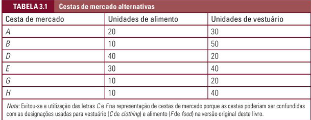
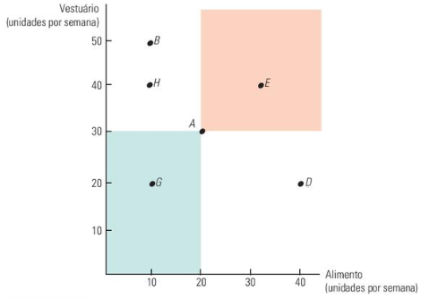
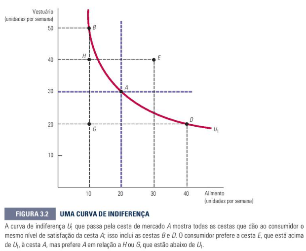
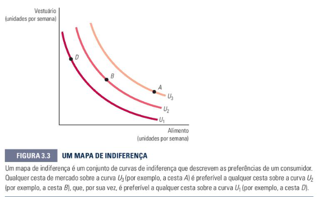
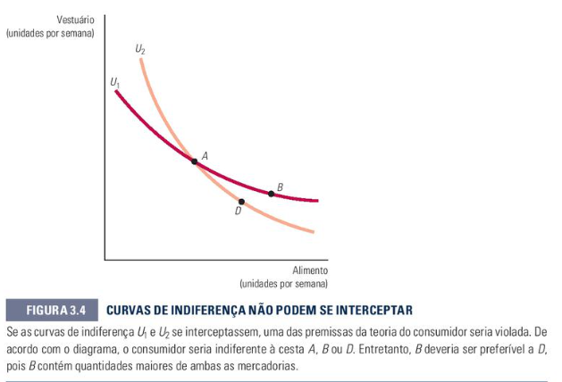
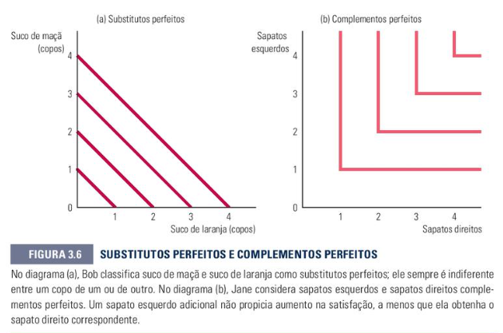
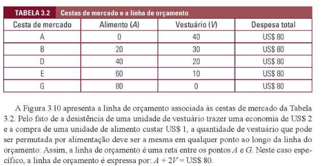
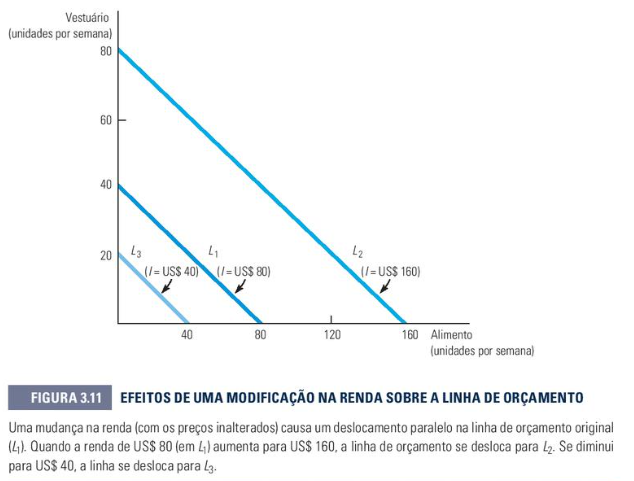
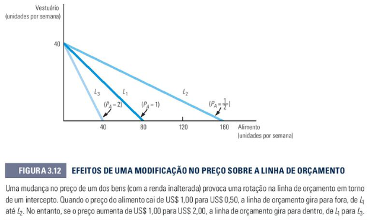

# TEORIA DO CONSUMIDOR_DEMANDA
Esse conteúdo se encontra no capítulo 3 do livro

## **3.1 Preferências do Consumidor (Página 67):**
Aqui iremos entender como funciona as preferências de um consumidor e entender quais os caminhos que afetam suas escolhas dentro do mercado.


### **Cestas de Mercado**:
  - O que é: Conjunto com quantidades determinadas de uma ou mais mercadorias. Podendo conter alimentos, roupas e outros produtos.
  - Exemplo:



### **Premissas Básicas sobre preferências**:
  - Integralidade (Plenitude):
    - Assume-se que as preferências são completas. Que o consumidor poderia escolher qualquer duas cestas A e B.
  - Transitividade:
    - As preferências são transitivas. Temos por exemplo 3 alimentos: Pão, Alface e Cebola. Se o consumidor prefere pão ao invés de Alface, e também prefere Alface ao invés de Cebola, ele também irá preferir pão ao invés de cebola.
  - Mais é melhor do que menos: Presumimos que todas as mercadorias são benéficas. Ou seja, os consumidores sempre vão preferir maiores quantidades de qualquer produto.

### **Curvas de Indiferença**:
É o modo em que representamos graficamente as preferências do consumidor. A **Curva de indiferença** representa todas as combinações de cestas de mercado que fornecem o mesmo nível de satisfação ao consumidor.

A seguir veremos uma tabela como exemplo:



Cada letra da tabela é uma cesta.

Podemos afirmar que a cesta A é preferível em relação a cesta G. Partindo da premissa que vimos anteriormente (mais é melhor do que menos). Porém em comparação a outras, não conseguimos comparar as cestas, pois precisamos de mais dados e precisão.

A seguir veremos uma tabela mais precisa.



Agora temos uma maior precisão e conseguimos fazer algumas comparações.

Note que a curva de indiferença passa por B, A e D, pois o consumidor é indiferente a eles (ou seja, ambas darão o mesmo nível de satisfação).

O consumidor iria preferir A a H, pois o H está abaixo da curva de indiferença

### **Mapas de Indiferença**:
É o conjunto das curvas de indiferença.

A seguir, um exemplo:



As curvas de indiferença não podem se interceptar. Para entendermos o por que, vejamos um mapa de indiferença suponhando que elas pudessem se interceptar.



Como A e B estão sobre a curva U1, eles são indiferentes. Da mesma forma, A e D estão sobre a curva U2, logo são indiferentes também. Assim, B e D deveriam ser indiferentes, porém não é o que acontece na figura. B é preferível a D, pois está acima da curva.

E isso viola nossa premissa de transitividade. Pois se A é indiferente a B e D, então B deveria ser indiferente a D.

### **Taxa marginal de substituição (TMS)**:
  - Quantidade máxima de um bem que um consumidor está disposto a deixar de consumir para obter uma unidade adicional de um outro bem

### **Substitutos perfeitos e complementos perfeitos:**

Observe a tabela a seguir:



Note que na tabela A), temos que o consumidor é indiferente ao suco de laranja ou suco de maça, pois se faltar um, o outro substitui no mesmo nível de satisfação (ou seja, é um substituto perfeito).

Agora na tabela B), temos que o consumidor não se sente satisfeito com o sapato esquerdo, a menos que tenha também o sapado direito, sendo assim, a satisfação só é alcançada quando o esquerdo tem o direito junto (ou seja, é um complemento perfeito)

### **Bens nocivos**:
Mercadorias que os consumidores preferem em menor quantidade em vez de maior quantidade

### **Utilidade**:
Índice numérico que representa a satisfação que um consumidor obtém com dada cesta de mercado

### **Função utilidade**:
Fórmula que atribui um nível de utilidade a cada cesta de mercado.


## **3.2 Restrições orçamentárias (Página 80):**

### **Linha de orçamento**:
a -> Quantidade de alimento

v -> Quantidade de vestuário

PA -> Preço de alimento

PV -> Preço de vestuário

PAa -> Preço do alimento multiplicado por sua quantidade

PVv -> Preço do vestuário multiplicado por sua quantidade

Adquirimos a linha de orçamento pela expressão:

```
PAa + PVv = I
```

Exemplo:
Considere um alimento A custando 1 e um vestuário custando 2.

Veja o gráfico a seguir:



### **Efeitos das modificações na renda e nos preços**:
- Modificações na renda:
  - Altera paralelamente a linha de orçamento (para fora se aumentar, para dentro se diminuir), sem alterar sua inclinação
  - Exemplo:



- Variação nos preços:
  - Altera a inclinação da linha de orçamento, rotacionando-a a partir do intercepto do bem cujo preço não mudou



## **3.3 A escolha do consumidor (página 84):**
- A cesta de mercado maximizadora deve cumprir dois requisitos:
  - Estar localizada sobre a linha de orçamento
  - Fornecer a combinação preferida de bens e serviços.

- No ponto de escolha ótima (equilíbrio), a inclinação da curva de indiferença é igual à inclinação da linha de orçamento:
```
TMS = Px / Py
```

- Soluções de Canto:
  - Situação em que o consumidor opta por maximizar a utilidade consumindo apenas um dos bens, ocorrendo quando a TMS é diferente da razão dos preços ao longo de toda a linha de orçamento.

## **3.5 Utilidade marginal e escolha do consumidor (página 93):**
- Utilidade marginal (UM):
  - Satisfação adicional obtida pelo consumo de uma unidade adicional de determinado bem
  - No ponto de equilíbrio, a **maximização da utilidade** é atingida através do **Princípio da igualdade marginal**:
  ```
    - UMGx (Utilidade marginal do bem x)
    - Px (Preço do bem x)
    - UMGy (Utilidade marginal do bem y)
    - Py (Preço do bem y)

    UMGx   UMGy
    ---- = ----
     px     py
    ```
    Ou seja, a utilidade adicional por unidade monetária gasta deve ser igual para todos os bens.