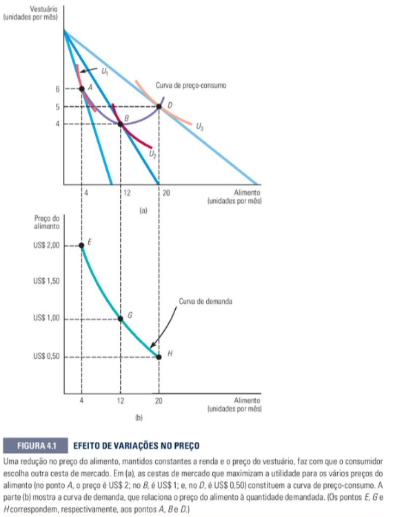
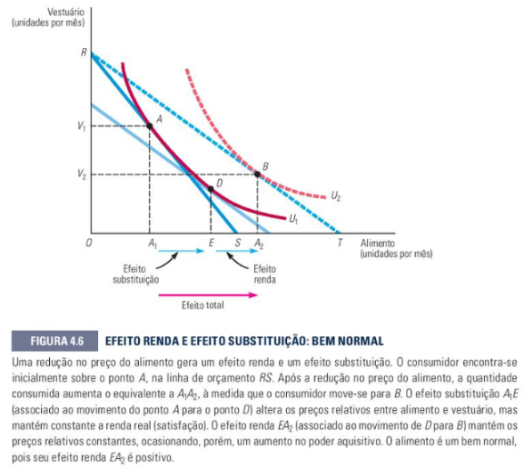
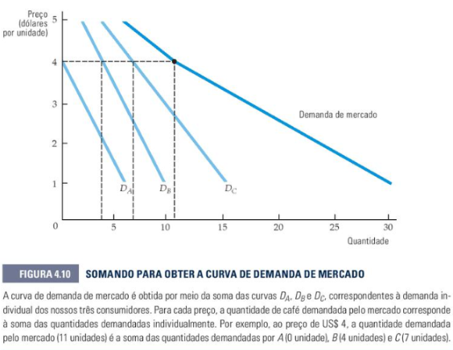

# DEMANDA: FUNÇÃO DEMANDA E TIPOS DE BENS
Esse conteúdo se encontra no **capítulo 4** do livro (e parcialmente no capítulo 2)

---

## **4.1 Demanda Individual (Página 108)**

### **Curva de Demanda Individual**
Relaciona a quantidade de um bem que um consumidor comprará com o preço desse bem, mantendo renda e outros preços constantes.

Ela surge da teoria do consumidor: para cada preço, encontramos a cesta ótima → conectando esses pontos → curva de demanda.



> O gráfico (a) mostra a **curva de preço-consumo**: cada ponto é a cesta ótima para um preço diferente. O gráfico (b) projeta esses pontos no eixo preço × quantidade, formando a **curva de demanda**.

### **Modificações no Preço**
- Variação no **preço do próprio bem** → **movimento ao longo da curva**
- Preço ↑ → quantidade demandada ↓ (e vice-versa)

### **Modificações na Renda**
- Variação na **renda** → **deslocamento da curva**
  - Renda ↑ e bem normal → curva desloca para a **direita**
  - Renda ↑ e bem inferior → curva desloca para a **esquerda**

### **Bens Normais versus Inferiores**

| Tipo | O que acontece quando renda ↑ | Elasticidade-renda (εᴿ) | Exemplo |
|---|---|---|---|
| **Normal - necessidade** | Consumo ↑ pouco | 0 < εᴿ < 1 | Alimentação básica |
| **Normal - luxo** | Consumo ↑ muito | εᴿ > 1 | Viagens, joias |
| **Inferior** | Consumo **↓** | εᴿ < 0 | Macarrão instantâneo |

> ⚠️ "Inferior" não significa má qualidade — apenas que o consumo cai quando a renda sobe.

### **Substitutos e Complementares**

| Tipo | O que acontece | Elasticidade-cruzada (εₓᵧ) | Exemplo |
|---|---|---|---|
| **Substitutos** | ↑ preço de Y → ↑ demanda de X | εₓᵧ > 0 | Manteiga e margarina |
| **Complementares** | ↑ preço de Y → ↓ demanda de X | εₓᵧ < 0 | Carro e gasolina |

---

## **4.2 Efeito Renda e Efeito Substituição (Página 115)**

Quando o preço de um bem **cai**, dois efeitos ocorrem simultaneamente:

- **Efeito Substituição:** o bem ficou mais barato em relação aos outros → consumidor substitui os outros por ele → quantidade **sempre aumenta**

- **Efeito Renda:** o poder de compra real aumentou → como se a renda tivesse subido:
  - Bem **normal** → compra mais → **reforça** o efeito substituição
  - Bem **inferior** → compra menos → **atenua** o efeito substituição

```
Efeito Total = Efeito Substituição + Efeito Renda
```



> O segmento **A₁E** é o efeito substituição (movimento ao longo da mesma curva de indiferença U₁). O segmento **EA₂** é o efeito renda (salto para a curva mais alta U₂). Juntos formam o efeito total **A₁A₂**.

**Exemplo:**
> Preço cai. Efeito substituição: +12 unidades. Efeito renda: +8 unidades.
> Efeito total: **+20 unidades**. Efeito renda positivo → **bem normal**.

---

## **4.3 Demanda de Mercado (Página 120)**

### **Da demanda individual à demanda de mercado**
A curva de demanda de mercado é a **soma horizontal** das curvas individuais — para cada preço, somam-se as quantidades de todos os consumidores:

```
Qmercado = QA + QB + QC + ...
```



> As curvas D_A, D_B e D_C são somadas horizontalmente. Note que a curva de mercado tem uma **quebra** porque o consumidor A não compra a preços acima de $4 — ele simplesmente sai da soma nesse ponto.

**Exemplo:**

| Preço ($) | Consumidor A | Consumidor B | Consumidor C | Mercado |
|---|---|---|---|---|
| 3 | 2 | 6 | 10 | **18** |
| 4 | 0 | 4 | 7 | **11** |

### **Elasticidade da Demanda**

**Elasticidade-Preço (εₚ):**

```
εₚ = (ΔQ / Q) / (ΔP / P) = (ΔQ/ΔP) × (P/Q)
```

| \|εₚ\| | Classificação | Receita quando P ↑ |
|----------|--------------|--------------------|
| > 1 | Elástica | Receita ↓ |
| = 1 | Unitária | Receita não muda |
| < 1 | Inelástica | Receita ↑ |

**Resolvendo exemplo:**

| Preço ($) | Demanda | Oferta |
|---|---|---|
| 60 | 22 | 14 |
| 80 | 20 | 16 |
| **100** | **18** | **18** |
| 120 | 16 | 20 |

> **Equilíbrio:** P = $100, Q = 18 (onde Qd = Qs)

> **Elasticidade entre $80 e $100:**
> ε = [(18−20)/19] / [(100−80)/90] = −0,105 / 0,222 ≈ **−0,47 → inelástica**

> **Escassez com preço máximo de $80:**
> Qd = 20, Qs = 16 → escassez = **4 unidades**

**Elasticidade-Renda (εᴿ):**
```
εᴿ = (ΔQ / Q) / (ΔR / R)
```
> Positiva = bem normal · Negativa = bem inferior · > 1 = luxo

**Elasticidade-Cruzada (εₓᵧ):**
```
εₓᵧ = (ΔQx / Qx) / (ΔPy / Py)
```
> Positiva = substitutos · Negativa = complementares

---

## **Ponto de Equilíbrio e Lucro**
```
Receita Total:  RT = P × Q
Custo Total:    CT = CF + CVu × Q
Lucro:          L  = RT − CT
```
> RT -> Receita Total

> Q -> Quantidade

> P -> Preço

> CT -> Custo total

> CF -> Custo Fixo

> CVu -> Custo Variável Unitário

> L -> Lucro

> Q* -> Quantidade no ponto de equilíbrio


**Ponto de equilíbrio** (lucro = 0):
```
Q* = CF / (P − CVu)
```

**Para atingir um lucro desejado L:**
```
Q = (CF + L) / (P − CVu)
```

**Exercício:**
> P = R$30 · CF = R$6.000 · CVu = R$14
>
> Margem de contribuição = 30 − 14 = **R$16/unidade**
>
> Ponto de equilíbrio: Q* = 6.000 / 16 = **375 unidades**
>
> Para lucro de R$3.200: Q = (6.000 + 3.200) / 16 = **575 unidades**