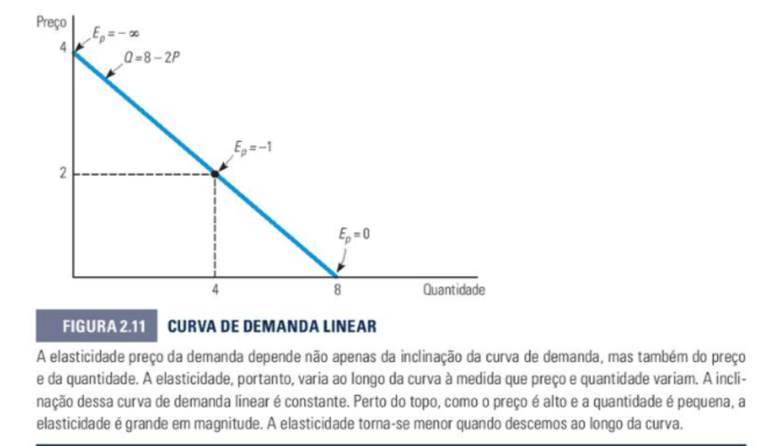

# ELASTICIDADES DA OFERTA E DA DEMANDA
Esse conteúdo se encontra no **capítulo 2** do livro (Seção 2.4)

---

## **2.4 Elasticidades da Oferta e da Demanda (Página 33)**

A elasticidade mede a variação percentual de uma variável em resposta à variação de 1% em outra. É usada para responder perguntas como: *se o preço subir 10%, quanto a quantidade demandada vai cair?*

---

### **Elasticidade-Preço da Demanda (Ep)**

Mede a variação percentual na quantidade demandada quando o preço varia 1%.

```
Ep = (%ΔQ) / (%ΔP) = (ΔQ/ΔP) × (P/Q)
```

> A elasticidade-preço é **sempre negativa** (preço sobe → quantidade cai). Trabalha-se com o **valor absoluto** para classificar.

| |Ep| | Classificação | O que significa |
|---|---|---|
| > 1 | **Elástica** | Q varia mais que proporcionalmente ao preço |
| = 1 | **Unitária** | Q varia na mesma proporção que o preço |
| < 1 | **Inelástica** | Q varia menos que proporcionalmente ao preço |
| = 0 | **Perfeitamente inelástica** | Q não varia com o preço (curva vertical) |
| → ∞ | **Perfeitamente elástica** | Qualquer variação de preço → demanda vai a zero (curva horizontal) |

> 💡 **Exemplo prático:** O preço da passagem de ônibus sobe 20% e a quantidade de passageiros cai apenas 5%. Como |Ep| = 5/20 = 0,25 < 1, a demanda é **inelástica** — faz sentido, pois muitas pessoas não têm alternativa e precisam usar o ônibus de qualquer forma.

---

#### **Elasticidade varia ao longo da curva linear**

Em uma curva de demanda linear (Q = a − bP), a inclinação é constante, mas a elasticidade **muda** em cada ponto pois P/Q varia.



> No topo da curva (P alto, Q pequeno) → |Ep| grande. No ponto médio → |Ep| = 1. Na base (P = 0) → |Ep| = 0.

> 💡 **Exemplo prático:** Considere Q = 8 − 2P. Quando P = 3, Q = 2 → Ep = −2 × (3/2) = **−3** (elástica). Quando P = 1, Q = 6 → Ep = −2 × (1/6) = **−0,33** (inelástica). Mesma curva, elasticidades bem diferentes dependendo do ponto.

---

#### **Elasticidade e Receita Total**

| Tipo | P sobe → Receita (P×Q) | P cai → Receita |
|---|---|---|
| Elástica (|Ep| > 1) | ↓ diminui | ↑ aumenta |
| Unitária (|Ep| = 1) | não muda | não muda |
| Inelástica (|Ep| < 1) | ↑ aumenta | ↓ diminui |

> 💡 **Exemplo prático:** Uma farmácia vende insulina (demanda inelástica). Se ela aumentar o preço em 30%, a quantidade vendida cai pouco (digamos, 5%) pois os diabéticos precisam do medicamento. A receita **sobe**. Já uma loja de sorvetes (bem supérfluo, elástico) que aumentar o preço em 30% pode perder tantos clientes que a receita **cai**.

---

#### **Fatores que determinam a elasticidade-preço**

| Mais elástico quando... | Menos elástico quando... |
|---|---|
| Muitos substitutos disponíveis | Poucos ou nenhum substituto |
| Bem supérfluo | Bem de necessidade básica |
| Longo prazo | Curto prazo |
| Definição estreita do bem (carne suína) | Definição ampla (alimentos) |

> 💡 **Exemplo prático:** A demanda por "Coca-Cola" é mais elástica do que a demanda por "refrigerante em geral" — porque se o preço da Coca sobe, o consumidor pode facilmente migrar para Pepsi ou outra marca. Já se o preço de todos os refrigerantes sobe junto, há menos alternativas.

---

### **Elasticidade-Preço no Ponto vs. no Arco**

**No ponto** (um ponto específico da curva):
```
Ep = (dQ/dP) × (P/Q)
```

**No arco** (entre dois pontos — usa médias):
```
Ep = (ΔQ / ΔP) × (P̄ / Q̄)

onde: P̄ = (P1 + P2) / 2  e  Q̄ = (Q1 + Q2) / 2
```

> 💡 **Exemplo prático:** O preço de um livro vai de R$40 para R$50 e as vendas caem de 200 para 160 unidades.
>
> ΔQ = −40 · ΔP = +10 · P̄ = 45 · Q̄ = 180
>
> Ep = (−40/10) × (45/180) = −4 × 0,25 = **−1,0 → unitária**
>
> A receita não muda: antes R$40×200 = R$8.000; depois R$50×160 = R$8.000. ✓

---

### **Elasticidade-Renda da Demanda (EI)**

Mede a variação percentual na quantidade demandada quando a renda varia 1%.

```
EI = (%ΔQ) / (%ΔI) = (ΔQ/ΔI) × (I/Q)
```

| Valor de EI | Classificação |
|---|---|
| EI > 1 | Bem normal de **luxo** |
| 0 < EI < 1 | Bem normal de **necessidade** |
| EI < 0 | Bem **inferior** |

> 💡 **Exemplo prático:** A renda de um trabalhador sobe 20% e ele passa a comprar 5% mais feijão (EI = 0,25 → **necessidade**), 40% mais viagens de avião (EI = 2,0 → **luxo**) e 30% menos macarrão instantâneo (EI = −1,5 → **inferior**, pois agora pode comprar comida melhor).

---

### **Elasticidade-Preço Cruzada da Demanda (EQxPy)**

Mede a variação percentual na quantidade do bem X quando o preço do bem Y varia 1%.

```
EQxPy = (%ΔQx) / (%ΔPy) = (ΔQx/ΔPy) × (Py/Qx)
```

| Sinal | Classificação |
|---|---|
| EQxPy > 0 | Bens **substitutos** (ex: manteiga e margarina) |
| EQxPy < 0 | Bens **complementares** (ex: gasolina e óleo) |
| EQxPy = 0 | Bens **independentes** |

> 💡 **Exemplo prático:** O preço da margarina sobe 10% e a demanda por manteiga sobe 8%. EQxPy = +0,8 → **substitutos** (as pessoas trocam a margarina pela manteiga). Já se o preço da gasolina sobe 10% e a demanda por óleo de motor cai 6%, EQxPy = −0,6 → **complementares** (as pessoas dirigem menos, então usam menos óleo também).

---

### **Elasticidade-Preço da Oferta (Es)**

Mede a variação percentual na quantidade ofertada quando o preço varia 1%.

```
Es = (%ΔQs) / (%ΔP) = (ΔQs/ΔP) × (P/Qs)
```

> Normalmente **positiva**: preço sobe → produtores ofertam mais.

| Curto prazo | Longo prazo |
|---|---|
| Menos elástica (produtores não conseguem ajustar capacidade rapidamente) | Mais elástica (há tempo para expandir produção) |

> 💡 **Exemplo prático:** O preço do café sobe 15% e os agricultores aumentam a produção em 3% no curto prazo (Es = 0,2 → inelástica, pois o café leva anos para crescer). No longo prazo, com novos plantios, a produção sobe 18% (Es = 1,2 → elástica). O tempo disponível para se adaptar é o fator decisivo.

---

### **Equilíbrio de Mercado e Escassez**

O equilíbrio ocorre onde **Qd = Qs**. Com um preço máximo abaixo do equilíbrio, surge escassez:

```
Escassez = Qd − Qs  (quando preço máximo < preço de equilíbrio)
```

> 💡 **Exemplo prático:** O mercado de aluguel de apartamentos está em equilíbrio com aluguel de R$2.000 e 1.000 unidades alugadas. O governo impõe um teto de R$1.500. A essa valor: proprietários ofertam 700 apartamentos (Qs), mas 1.300 pessoas querem alugar (Qd). Escassez = 1.300 − 700 = **600 apartamentos** faltando no mercado.

---

## Cola Final

```
Elasticidade-preço:    Ep  = (ΔQ/ΔP) × (P/Q)     → sempre negativa
Elasticidade-renda:    EI  = (ΔQ/ΔI) × (I/Q)     → + normal / − inferior
Elasticidade-cruzada:  Exy = (ΔQx/ΔPy) × (Py/Qx) → + subst. / − compl.
Elasticidade-oferta:   Es  = (ΔQs/ΔP) × (P/Qs)   → sempre positiva

Elasticidade arco: usar P̄ = (P1+P2)/2  e  Q̄ = (Q1+Q2)/2

|Ep| > 1 → elástica   → P↑ faz receita ↓
|Ep| < 1 → inelástica → P↑ faz receita ↑
|Ep| = 1 → unitária   → receita não muda

Escassez (preço máximo): Qd − Qs
```