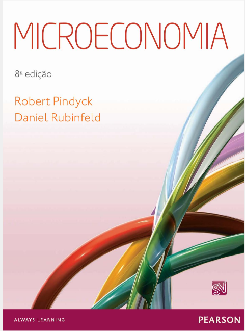

# BEM VINDO AO REPOSITÓRIO DE ECONOMIA
Olá colega, se você está vendo isso possivelmente está louco estudando para a prova da 2º Unidade de economia. Aqui você irá encontrar um material de estudos organizado o suficiente para lhe dar repertório e fechar essa prova. Se puder, deixe uma estrelinha como forma de agradecimento, por que a produção desse repositório levou (e está levando) muito tempo. Agradeço pela confiança e vamos juntos!!!

A seguir, estão algumas instruções de como esse repositório está organizado.

## Material usado:
O Livro usado é **Microeconomia - pindyck. 8º edição**, esse aqui da imagem:



Você pode acessar ele na Biblioteca Virtual para um maior aprofundamento.

## Como o repositório está organizado:
Esse repositório está organizado de acordo com os conteúdos cobrados, desta maneira:

````md

├── README.md                  # Apresentação do repositório e guia de estudos
├── Parte1_Consumidor_Demanda/
│   ├── 01_Teoria_Consumidor.md  # Preferências, Utilidade, Restrição Orçamentária
│   ├── 02_Demanda_Bens.md       # Funções de Demanda, Efeito Renda e Substituição
│   └── 03_Elasticidades.md      # Elasticidade-Preço Demanda/Oferta e Equilíbrio
└── Parte2_Firma_Producao/
    ├── 04_Teoria_Producao.md    # Teoria da Firma e Processo Produtivo
    ├── 05_Teoria_Custos.md      # Custos Fixos, Variáveis e Totais
    └── 06_Maximizacao_Lucro.md  # Ponto de Equilíbrio e Maximização
````

## Arquivos.md
Nesses arquivos se encontrará o conteúdo, e também a especificação do capítulo e suas respectivas seções, pra caso você queira olhar diretamente no livro.

Exemplo:
``` markdown
# Teoria do Consumidor
No livro, está presente no capítulo 3.

Obs: E os conteúdos são separados em tópicos específicos de acordo com suas seções específicas, segue o exemplo abaixo!!!

## 3.1 Preferências do Consumidor
O "3.1" indica a seção a qual pertence o tópico

## 3.2 Restrições orçamentárias
Blá blá blá

## 3.3 A escolha do consumidor
Blá blá blá


E assim por diante...

```

Bons estudos!!!