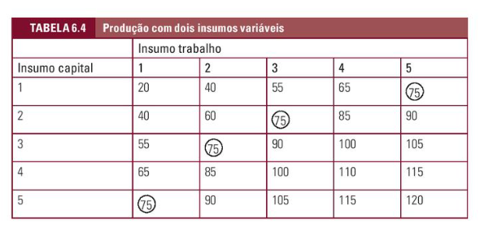
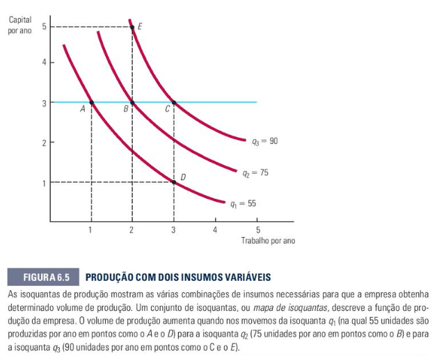

# Teoria da Firma e Processo produtivo
Esse tópico se encontra no capítulo 6 do livro

## **6.1 As firmas e suas decisões de produção (página 192):**
- **Por que as firmas existem:**
  - As firmas centralizam e coordenam a produção. Sem elas seria caótico e muito caro se cada trabalhador tiver que assinar um contrato individual com fornecedores e outros trabalhadores para cada microtarefa do dia a dia
  - > **Exemplo prático**: Imagine um mercado editorial onde uma professora de economia quer publicar um livro didático.
    - > **Explicação**: Se não existissem as firmas, o autor do livro teria que procurar, negociar o preço e assinar um contrato individual com o revisor de texto, depois com o diagramador, depois com o fornecedor de papel e, por fim, com a gráfica. A Firma (Editora de Livros) existe exatamente para resolver isso: ela contrata e junta todos esses profissionais sob a mesma estrutura corporativa, centralizando a operação e tornando o processo eficiente.
- **Fatores de Produção (Insumos):**
  - Trabalho(L): Mão de obra (horas de trabalho)
  - Capital (K): Máquinas, computadores, instalações e ferramentas
  - Matérias-primas: Insumos que são transformados (ex: tecido, botões)
- **A função de produção:**
  - É a relação matemática que dita o volume máximo de produto(q) que a firma consegue gerar combinando Capital e Trabalho:
  - > q = F(K,L)
  - **Curto Prazo vs Longo prazo:**
    - Curto prazo: Período onde pelo menos um dos fatores é **fixo**(geralmente o capital, K, pois não dá para construir uma nova fábrica da noite para o dia).
    - Longo prazo: Tempo suficiente para que todos os fatores se tornem variáveis
    - > **Exemplo prático**: A Editora de Livros possui um parque gráfico com 2 impressoras e espaço físico limitado.
      - > **Explicação**: Se a editora precisar entregar uma tiragem extra de livros para daqui a três dias, ela está operando no curto prazo. Ela não consegue comprar e instalar uma nova impressora industrial nesse tempo (o Capital é fixo). A única saída é contratar mais horas de trabalho ($L$) dos funcionários atuais ou temporários. Por outro lado, se a editora planejar comprar novas impressoras automáticas e expandir o galpão para o ano que vem, ela estará agindo no longo prazo (onde tanto $K$ quanto $L$ podem mudar livremente).

## 6.2 Produção com um insumo variável (trabalho) (página 196):
Analisa a dinâmica de curto prazo da empresa: a estrutura física e as máquinas estão congeladas ($K$ é constante) e alteramos apenas a quantidade de trabalhadores ($L$).

- **Produto Médio ($PMe_L$):** É a média de produção por funcionário, obtida dividindo a produção total pela quantidade de trabalho ($q / L$).

- **Produto Marginal ($PMg_L$):** É o acréscimo de produção trazido pela contratação de uma unidade adicional de trabalho ($\Delta q / \Delta L$).

- **A Lei dos Rendimentos Marginais Decrescentes:** À medida que adicionamos trabalhadores a um fator de produção que está fixo (como o espaço ou uma máquina), chega-se a um ponto em que a produtividade extra de cada novo funcionário passa a diminuir.

- > **Aplicação Prática:** A sala de diagramação e edição de arte da Editora de Livros possui apenas 4 computadores de alta performance (Capital Fixo).
  - > **Explicação:** Se a editora colocar 1 ou 2 diagramadores, eles produzem bem. Ao colocar 4 diagramadores, todos os computadores ficam ocupados e a produção total atinge seu ponto ideal de saturação. Se a editora decidir contratar um 5º diagramador, ele não terá um computador disponível imediatamente. Ele precisará esperar um colega terminar, fazer tarefas secundárias ou revezar a máquina.
  - > A produção total de páginas de livros até pode subir um pouquinho se eles cooperarem, mas o Produto Marginal (a contribuição extra desse 5º funcionário) será muito menor do que a contribuição que o 2º ou o 3º funcionário trouxeram. Isso é o rendimento marginal decrescente agindo devido ao teto do capital fixo.

## 6.3 Produção com Dois insumos Variáveis (página 205)
Analisa o longo prazo: a firma tem tempo e recursos para alterar livremente tanto o número de funcionários ($L$) quanto a quantidade de maquinários ($K$).

- **Isoquantas:** Curvas em um gráfico que mostram todas as combinações possíveis de Capital e Trabalho que geram exatamente o mesmo nível de produção de produtos.

Exemplo:

- **Taxa Marginal de Substituição Técnica (TMST):** É a quantidade de Capital que a empresa consegue reduzir quando uma unidade adicional de Trabalho é introduzida, de modo que o nível de produção permaneça constante:
$$
\text{TMST} = -\frac{\Delta K}{\Delta L} = \frac{PMg_L}{PMg_K}
$$

- > Aplicação Prática:: A Editora estabeleceu como meta rodar uma tiragem de exatamente 10.000 cópias de um livro didático de economia.
  - > Explicação: No longo prazo, a editora pode escolher duas combinações diferentes para atingir essa mesma meta de 10.000 livros (ou seja, escolher dois pontos na mesma curva de isoquanta):
    - > Um processo Capital-Intensivo: Comprar 2 impressoras automáticas de última geração que exigem apenas 2 operadores de painel para funcionar.
    - > Um processo Trabalho-Intensivo: Utilizar apenas 1 impressora manual mais antiga e contratar 8 operários para alimentar as resmas de papel e carregar os livros manualmente. A TMST mede matematicamente quantas máquinas a menos a editora precisa se optar por colocar mais trabalhadores no chão de fábrica, mantendo os mesmos 10.000 livros finais.
## **6.4 Rendimentos de Escala (página 213):**
Avalia a eficiência da firma quando ela cresce por igual, ou seja, quando ela decide aumentar todos os seus insumos (Capital e Trabalho) simultaneamente e na mesma proporção no longo prazo.

- **Rendimentos Crescentes de Escala:** A firma dobra todos os insumos e a produção mais que dobra.

  - > **Aplicação Prática:** A Editora de Livros decide duplicar o tamanho do seu galpão gráfico, comprar o dobro de máquinas e contratar o dobro de operários.

  - > **Explicação:** Com o espaço expandido e mais recursos, a editora consegue implementar uma linha de montagem em esteira altamente especializada, onde cada funcionário executa apenas uma microtarefa (um só corta, um só cola, um só embala). Por causa dessa extrema especialização, a produção de livros triplica. O negócio ganhou eficiência ao expandir sua escala.

- **Rendimentos Constantes de Escala:** A firma dobra os insumos e a produção dobra de forma perfeitamente proporcional.

  - > **Aplicação Prática:** A Editora de Livros decide clonar a sua operação atual, abrindo uma segunda filial em outro estado com exatamente a mesma metragem, o mesmo número de máquinas e o mesmo número de funcionários. A produção total de livros da empresa nacional simplesmente dobra.

- **Rendimentos Decrescentes de Escala:** A firma dobra os insumos e a produção cresce, mas menos que o dobro.

 - > **Aplicação Prática:** A Editora cresce de forma descontrolada e vira um império gigantesco, comprando dezenas de galpões e contratando milhares de funcionários. A estrutura fica tão massiva que a comunicação entre os autores, os revisores e as gráficas espalhadas vira um pesadelo burocrático, com reuniões intermináveis e perda de controle. Eles dobraram os gastos com máquinas e pessoas, mas a produção final de livros subiu apenas 40% devido aos problemas de gestão e gargalos organizacionais gerados pelo tamanho excessivo da empresa.