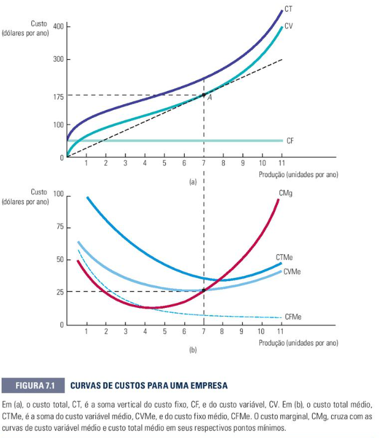

# O Custo de Produção
Este tópico se encontra no capítulo 7 do livro

## 7.1 Medição dos Custos: Quais Custos Importam?(página 220):
Antes de realizar qualquer cálculo matemático, é crucial entender a diferença entre a visão contabilística tradicional e a visão económica sobre os custos de uma firma.

- **Custo Económico vs. Custo Contabilístico :**
  - **Custo Contabilístico:** Envolve as despesas reais (gastos monetários explícitos e históricos) mais a depreciação de equipamentos. É o custo que sai no extrato bancário.
  - **Custo Económico:** É o custo total da utilização dos recursos na produção. Ele engloba o custo contabilístico, mas adiciona o **Custo de Oportunidade**.

- **Custo de Oportunidade:** É o custo associado às oportunidades perdidas quando os recursos da empresa não são aplicados na sua alternativa de uso de maior valor.
- > **Aplicação Prática:**: Imagine que o dono da Editora de Livros trabalha em tempo integral a gerir o seu próprio negócio de publicações e não tira um salário fixo.
  - > **Explicação:** O contabilista não vai registar um salário para o dono (pois não há saída de dinheiro explícita). No entanto, o economista vai calcular o Custo de Oportunidade: se este dono é um excelente administrador e poderia estar a ganhar 5.000€ por mês a gerir uma empresa concorrente, a sua decisão de ficar na própria editora custa "invisivelmente" 5.000€ mensais à firma. Esse valor precisa de ser considerado para saber se o negócio é realmente viável.
- **Custos Irrecuperáveis (Sunk Costs):** São despesas que já foram efetuadas e que não podem ser recuperadas por nenhuma decisão futura. Devem ser completamente ignorados na tomada de decisões económicas da firma.
- > **Aplicação Prática:** A Editora pagou 10.000€ a uma empresa de consultoria no ano passado para pesquisar se o mercado estava interessado em livros de poesia. O relatório concluiu que o mercado de poesia está falido.
- **Explicação:** Estes 10.000€ são um custo irrecuperável (sunk cost). Se a editora agora estiver em dúvida se deve usar as suas prensas para imprimir livros de economia ou livros de poesia, o gasto passado com a consultoria não deve entrar no cálculo da decisão atual. O dinheiro já sumiu e não volta atrás; a firma deve focar-se apenas nos custos e receitas futuros.

## 7.2 Custos no Curto Prazo (página 227):
No curto prazo, a limitação física da empresa (Capital fixo) obriga a dividir os custos totais em componentes fixas e variáveis. Esta é a matemática exata utilizada para resolver os problemas de tabela de produção em sala de aula.
- **🧮 1. Os Custos Totais e suas Divisões**:
  - **Custo Fixo ($CF$):** Custo que não varia com o nível de produção da empresa. Ele existe mesmo se a produção for igual a zero.
  - **Custo Variável ($CV$):** Custo que se altera diretamente conforme o volume de produção ($q$) se modifica.
  - **Custo Total ($CT$):** É a soma de todas as despesas da firma:
  $$CT = CF + CV$$
  - > **Aplicação Prática:** A Editora de Livros possui custos de infraestrutura e arrendamento gráfico estipulados em 6.000€ fixos, e gasta 14€ em insumos (papel, tinta, direitos de autor) por cada livro impresso.
  - > **Explicação:** O $CF$ da editora é 6.000€ (mesmo que não imprima nenhum livro este mês, o arrendamento do galpão tem de ser pago). O $CV$ é dinâmico: se imprimir 100 livros, o custo variável será de $14 \times 100 = 1.400€$. Se a meta for produzir uma tiragem ($q$) de 500 livros, a equação do Custo Total será:
   $$CT = 6.000 + 14(500) = 6.000 + 7.000 = 13.000€$$
- **📈 2. Custos Unitários (Médios e Marginais):**
    - Para medir a eficiência de custos por unidade de livro produzido, aplicam-se as seguintes relações:
    - **Custo Marginal ($CMg$):** É o acréscimo no custo total decorrente da produção de uma unidade adicional de produto. Como o custo fixo não se altera, o $CMg$ mede a variação ocorrida no custo variável:
  - $$CMg = \frac{\Delta CT}{\Delta q} = \frac{\Delta CV}{\Delta q}$$
  - **Custo Total Médio ($CTMe$):** O custo total dividido pelo nível de produção total ($CT / q$). Indica quanto custa, em média, cada unidade fabricada.
  - **Custo Fixo Médio ($CFMe$):** O custo fixo dividido pela produção ($CF / q$). É sempre decrescente: conforme a produção aumenta, o custo fixo é "diluído" por mais unidades (Efeito de Diluição).
  - **Custo Variável Médio ($CVMe$):** O custo variável dividido pelo nível de produção ($CV / q$).
- **📊 3. O Formato das Curvas de Custo (Análise Gráfica)**: Ao analisar o comportamento gráfico das curvas de custos unitários no curto prazo, existem três regras de ouro fundamentais para os testes:

    Exemplo de curvas:

    

    - A curva de $CFMe$ desce continuamente aproximando-se do eixo horizontal, provando a diluição do custo fixo.
    - A curva de Custo Marginal ($CMg$) corta as curvas de Custo Total Médio ($CTMe$) e Custo Variável Médio ($CVMe$) exatamente nos seus pontos de **mínimo**.
    - **A Relação de Tração:** Se o Custo Marginal estiver abaixo da média, ele "puxa" a média para baixo (a média decresce). Se o Custo Marginal estiver acima da média, ele "puxa" a média para cima (a média cresce).
    - > **Aplicação Prática:** A Editora de Livros percebe que, ao imprimir o livro nº 101, o custo marginal desse livro específico foi de 10€, enquanto o Custo Médio dos primeiros 100 livros estava em 25€.
    - > **Explicação:** Como o custo de fabricar a unidade extra (10€) veio abaixo da média histórica (25€), a inclusão deste novo livro vai fazer com que o Custo Total Médio de toda a tiragem caia. Isto explica graficamente por que a curva de $CTMe$ decresce até encontrar o ponto de interseção com o $CMg$.