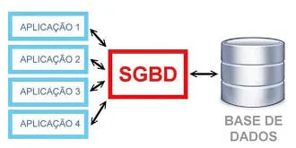

# Introdução aos Bancos de Dados — 12/08/2026

## Compartilhamento de dados

**Exemplo:** em uma empresa com produção, vendas e compras trabalhando em sistemas isolados, surgem problemas como:
- Falta de sincronização entre os sistemas
- **Redundância de dados** (o principal problema)

### Redundância de dados
Ocorre quando um determinado dado está representado várias vezes no sistema.

#### Tipos de redundância de dados

**Redundância controlada:**
Acontece quando o software tem conhecimento da múltipla representação do dado e garante a sincronia entre as diversas representações.

**Redundância não controlada:**
Acontece quando a responsabilidade pela manutenção da sincronia entre as diversas representações de um dado está com o usuário, e não com o software.

> **Consequências:** entrada repetida do mesmo dado, inconsistência de dados.

---

A solução para evitar isso é o **compartilhamento de dados**.

#### Como compartilhar esses dados?
Através dos **bancos de dados**!

---

## Dados vs Informações

| Conceito | Exemplo | Definição |
|---|---|---|
| **Dado** | 13 (apenas) | Fato bruto, ainda não processado |
| **Informação** | 13 Bananas | Contexto atribuído ao dado, gerando significado — resultado de processamento |

---

## O que é um Banco de Dados

É uma estrutura computacional compartilhada e integrada que armazena um conjunto de **metadados** e **dados do usuário final**.

- **Metadados:** dados sobre os dados — descrevem a estrutura, o tipo e as características dos dados armazenados no banco (ex.: nome da coluna, tipo do dado, tamanho).
- **Dados do usuário final:** os dados propriamente ditos, que são de interesse direto do usuário.

---

## Sistema de Gerenciamento de Banco de Dados (SGBD)

### O que é
É um conjunto de programas que gerenciam a estrutura do banco de dados e controlam o acesso aos dados armazenados.

### Vantagens
- Aprimoramento do compartilhamento de dados
- Aprimoramento na segurança dos dados
- Melhoria na integração dos dados

---

## Modelo de Banco de Dados

### O que é
É uma descrição formal da estrutura de um banco de dados.

### Tipos
- Conceitual
- Lógico
- Físico

---

### Modelo Conceitual

**O que é:**
Um modelo de dados abstrato, que descreve a estrutura de um banco de dados de forma independente de um SGBD particular.

---

### Modelo Lógico

**O que é:**
Representa a estrutura de dados de um banco de dados conforme vista pelo usuário do SGBD.

---

### Modelo Físico

**O que é:**
Descreve como os dados são efetivamente armazenados no computador, representando informações como formato dos registros, ordenação dos arquivos e estruturas de acesso (ex.: índices) — está associado a um SGBD específico.