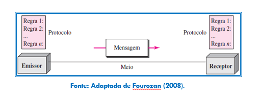
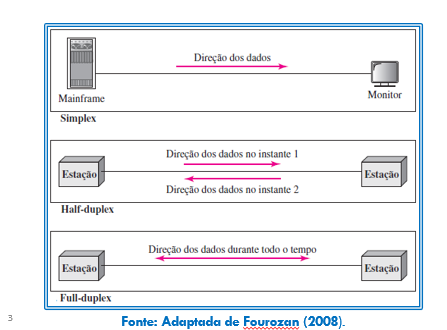
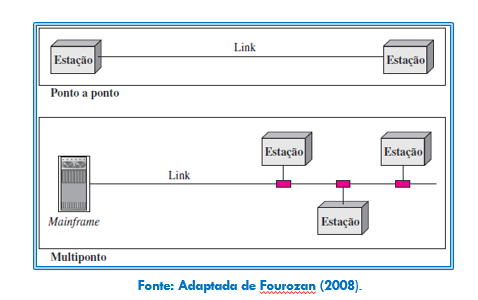
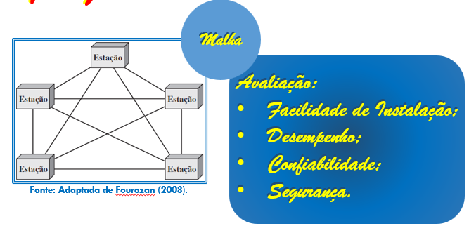
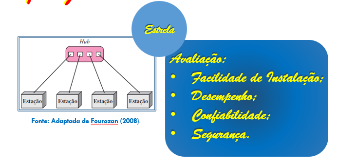

# Introdução às Redes de Computadores — 12/08/2026

## Introdução

**Emissor → Mensagem (meio) → Receptor**

- **Mensagem**: não conseguimos ver
- **Emissor/Receptor**: conseguimos ver

**O Problema**: suponha que o *emissor* mande `1000000`. O *receptor* pode acabar recebendo `1000001`.

> Durante o tráfego, os bits **PODEM** se corromper.

Para resolver isso, teremos o **Protocolo**. O protocolo é um programa!

---

### Protocolo

Define, dentro de si, regras para tratar erros que podem acontecer em um tráfego de mensagem.

**Exemplo de regra:** "O número de bits '1' é par" → se a mensagem for `100`, ele coloca `1` na frente e fica `1001`. `1001` é a mensagem final.

**Fluxo de verificação:**

1. O protocolo do receptor recebe a mensagem primeiro.
2. O protocolo analisa a mensagem e verifica as regras.
   - Se ele recebe `1011`: compara com a regra e vê que o número de bits **não** é par → conclui que a mensagem está **CORROMPIDA**.
   - Se ele recebe a mensagem certa: elimina os bits do cabeçalho e manda a mensagem para o receptor.

**O que o protocolo faz quando detecta corrupção:**
- Tenta recuperar
- Descarta *(maioria dos casos)*

---

## Fluxo de Dados

### Simplex
- Único sentido
- Sempre um Mainframe e um Monitor
- Ex: controle de abrir portão (Mainframe → Controle / Monitor → Motor)

### Half-duplex
- Duplo sentido
- 2 estações
  - Estação 1 → Estação 2
  - Estação 2 → Estação 1
- Não acontece ao mesmo tempo
- Exemplo: walkie-talkie

### Full-duplex
- Mesma coisa do Half-duplex, mas pode ocorrer ao mesmo tempo
- Exemplo: redes cabeadas no geral

---

## Tipos de Conexão

### Ponto a ponto
- Conexão exclusiva e dedicada entre **apenas dois** dispositivos.
- O meio de transmissão não é compartilhado com outras estações.

### Multiponto
- Você tem um cabo onde faz um corte e coloca um T que liga diferentes estações.
- Só quem recebe e entende a mensagem é o destinatário, através de uma criptografia.

---

## Topologias

**Principais tipos:**
- Malha
- Estrela
- Barramento
- Anel
- Híbrida

### Malha

- Ligação das máquinas utilizando conexões ponto a ponto.

**Avaliação:**

| Critério | Análise |
|---|---|
| Facilidade de instalação | Catástrofe — cada estação precisa ter várias placas de rede |
| Desempenho | Rápida entrega de mensagem e menos probabilidade de erro |
| Confiabilidade | Bom funcionamento mesmo com erros |
| Segurança | Boa — como as conexões são diretas entre os pontos, a mensagem não passa por estações intermediárias, reduzindo o risco de interceptação |

**Onde é boa:**
- Quando se tem uma quantidade pequena de máquinas
- Quando há garantia de que o número de máquinas não vai crescer

### Estrela

Existe uma conexão central que é conectada diretamente às estações que irão receber uma mensagem, em ponto a ponto.

- Se A tem uma mensagem para enviar para D:
  - A manda para a central, e a central manda para D.

**Avaliação:**

| Critério | Análise |
|---|---|
| Facilidade de instalação | Excelente (a melhor) |
| Desempenho | Razoável — toda comunicação depende da central, que pode virar um gargalo conforme aumenta o número de estações |
| Confiabilidade | Se a central cair, cai tudo |
| Segurança | Depende da central |