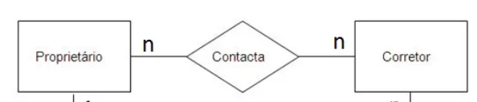
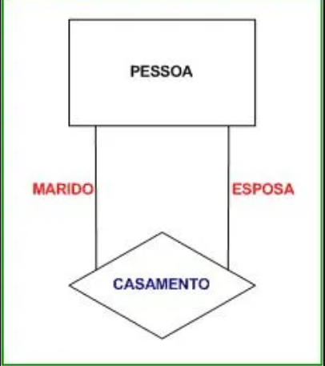
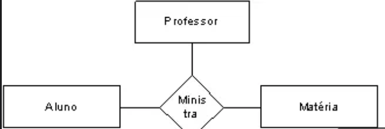

# Aula 03 - Abordagem Entidade-Relacionamento

## Entidade:
É um conjunto de objetos da realidade modelada sobre os quais deseja-se manter dados no banco de dados

Exemplos:

Representa com retângulos, como na imagem abaixo:

Começa com a letra maiúscula (ou tudo maiúsculo)

### Propriedades das entidades:
- Relacionamento
- Atributos
- Generalizações/especializações

Se for necessário recorrer a essa entidade, chama-se ocorrência de entidade

## Relacionamento:
É um conjunto de associações entre ocorrências de entidades

Representado como um losângulo, verbo no infinitivo:

Proprietário e Corretor são entidades

Era pra ser "Contactar", releve isso.

## Autorrelacionamento:
Não necessariamente um relacionamento associa entidades diferentes, pode-se ter, portando, um autorrelacionamento

### Papel
Exemplo de um papel de um autorrelacionamento:

## Cardinalidade
É o número (mínimo e máximo) de ocorrências de entidade associadas a uma ocorrência da entidade em questão através do relacionamento

### Cardinalidade máxima:
Exemplo:
Um departamento estára lotado com um número n de empregados

A cardinalidade máxima  de departamento é n

(coloque a imagem de 2 entidades em retângulos, um de departamento, outro de empregado, e lotar no meio como relacionamento no formato de losangulo)

### Classificação de Relacionamentos Binários
A cardinalidade máxima pode ser (complete)

Exemplo de relacionamento binário 1:1

Empregado (1) ------ Alocar ------ Mesa(1)

Exemplo de relacionamento binário 1:n

Aluno (n) ------ Matricular ------ Curso(1)

Exemplo de relacionamento binário n:n

Médico (n) ------ Consultar ------ Pacientes(n)

### Relacionamento Ternário:
É um tipo de relacionamento que estabelece uma associação entre três entidades

Exemplo:

### Cardinalidade Mínima
É o número mínimo de ocorrência de entidade associadas a uma ocorrência de uma entidade através de um relacionamento

Duas cardinalidades mínimas são consideradas:
- Mínima 0
- Mínima 1

Exemplo:

Empregado (0,1) ------- Alocar ------- (1,1) Mesa

(adicione complemento como tipo: "Leitura disso", pra facilitar a compreensão, faça isso em todos os exemplos que estão aqui nas anotações)

