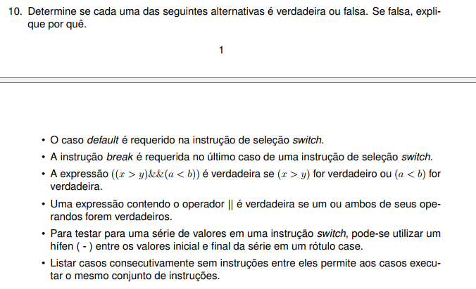

# RESPOSTA - QUESTÃO 10

- **Falsa**. O caso default é opcional. Ele é executado quando nenhum case corresponde ao valor.
- **Falsa**. O break no último caso é opcional, pois não há outro caso para executar depois dele.
- **Falsa**. O operador && exige que ambas as condições sejam verdadeiras.
- **Verdadeira**. O operador || retorna verdadeiro se pelo menos um dos operandos for verdadeiro.
- **Falsa**. O switch não permite utilizar hífen para representar uma série de valores. Cada valor deve ser especificado em um case separado.
- **Verdadeira**. Casos consecutivos sem instruções entre eles executam o mesmo conjunto de instruções.