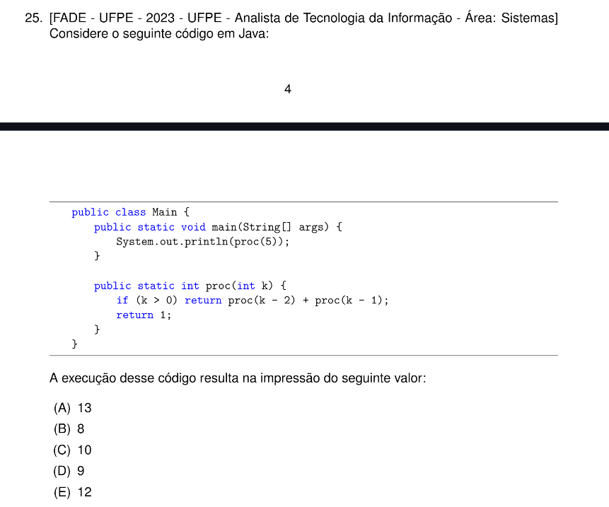

# QUESTÃO 25 - LISTA I

Resposta:

(A) 13

Resolução das chamadas ($k > 0$ calcula proc(k - 2) + proc(k - 1)):
- proc(1) = proc(-1) + proc(0) = $1 + 1$ = 2
- proc(2) = proc(0) + proc(1) = $1 + 2$ = 3
- proc(3) = proc(1) + proc(2) = $2 + 3$ = 5
- proc(4) = proc(2) + proc(3) = $3 + 5$ = 8
- proc(5) = proc(3) + proc(4) = $5 + 8$ = 13