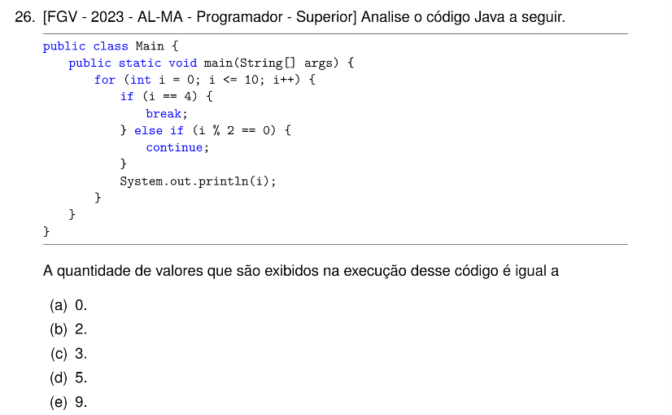

# QUESTÃO 26 - LISTA I

Resposta:

(b) 2

- i = 0: 0 % 2 == 0 é verdadeiro $\rightarrow$ o comando continue ignora a impressão e avança para o próximo passo.
- i = 1: Ambas as condições (i == 4 e i % 2 == 0) são falsas $\rightarrow$ o valor 1 é exibido.
- i = 2: 2 % 2 == 0 é verdadeiro $\rightarrow$ o comando continue pula a impressão.
- i = 3: Ambas as condições são falsas $\rightarrow$ o valor 3 é exibido.
- i = 4: i == 4 é verdadeiro $\rightarrow$ o comando break interrompe e encerra o laço de repetição imediatamente.