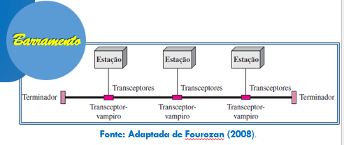
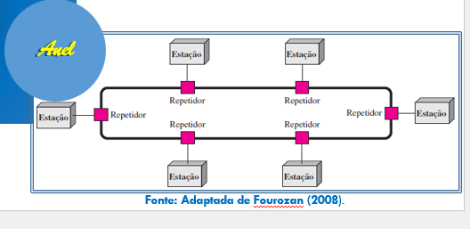
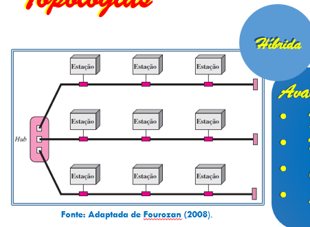
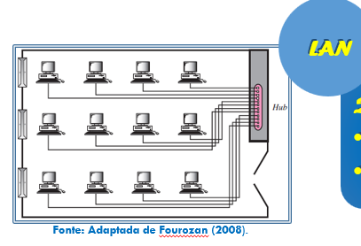
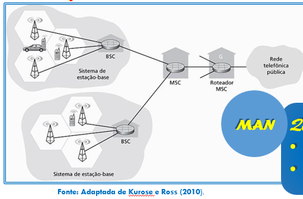
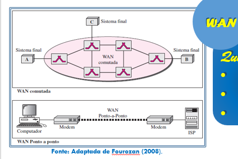
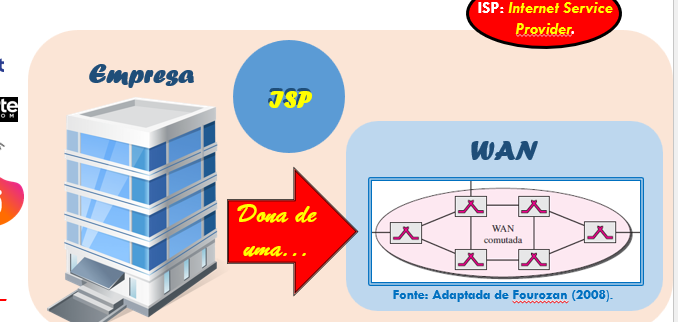
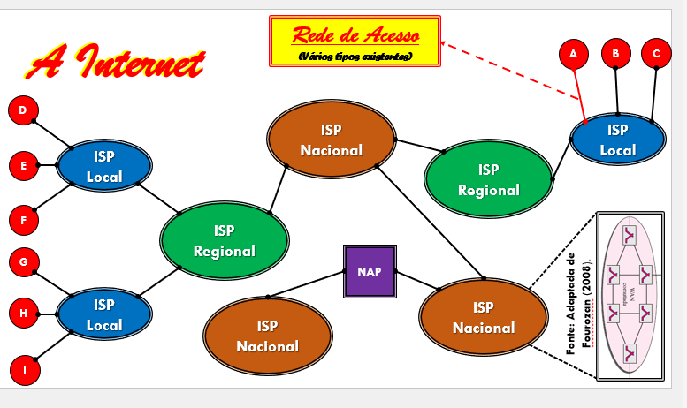
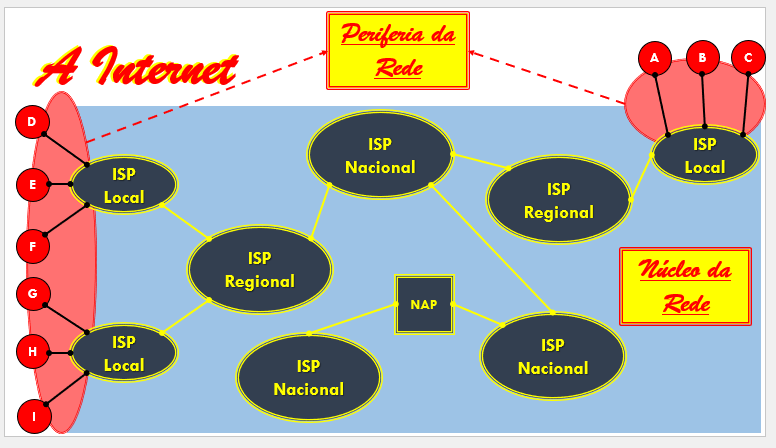

# Introdução às redes de Computadores - 14/08/2026

### Barramento

Na topologia em barramento, todas as estações são conectadas a um único meio de transmissão compartilhado (um cabo central), e qualquer mensagem enviada por uma estação é propagada por todo o barramento, sendo "ouvida" por todas as outras.

- Avaliação:
  - Facilidade de Instalação: Tranquilo, basta ligar cada estação ao mesmo cabo, sem necessidade de equipamentos centrais (como um hub ou switch). Isso reduz custo de cabeamento, mas o comprimento total do barramento é limitado (atenuação do sinal) e requer terminadores nas pontas para evitar reflexão do sinal.
  - Desempenho: Tem um problema chamado de colisão, quando duas mensagens colidem e o resultado da mensagem é a MISTURA dessas duas. 70% é colisão.
  - Confiabilidade: Quando o problema ocorre no meio físico, você cria duas ilhas e agora não tem mais troca entre todos.
  - Segurança: Não é segura porque todos recebem a mensagem.

- Em que cenário é boa:
  - Quando você tem um modo que seja simplex, e você não esteja preocupado com a segurança.

### Anel

Na topologia em anel, as estações são conectadas de forma circular, cada uma ligada apenas às duas vizinhas. Cada estação funciona como uma repetidora: recebe a mensagem, verifica se é o destino e, caso não seja, retransmite para a próxima estação do anel, até a mensagem chegar ao destinatário.

- Avaliação:
  - Facilidade de instalação: Fácil, se quiser adicionar uma estação é apenas conectar.
  - Desempenho: Tem a questão de se formarem filas de mensagens nos repetidores. Desempenho baixo.
  - Confiabilidade: Nada pode dar problema, logo a confiabilidade é pouca (se um nó ou um trecho do cabo falha, o anel inteiro pode ser interrompido).
  - Segurança: Baixa segurança, pois toda mensagem passa em outras estações.

- Quando é bom:
  - Quando segurança não é problema.

### Híbrida
Mistura de duas ou mais topologias (barramento, anel, estrela, malha), combinando suas características.

- Avaliação:
  - Facilidade de instalação: Varia conforme as topologias combinadas, tende a ser mais trabalhosa que uma topologia pura.
  - Desempenho: Pode aproveitar os pontos fortes de cada topologia usada (ex.: melhor desempenho onde há estrela, menor custo onde há barramento).
  - Confiabilidade: Geralmente maior, pois falhas em um segmento não necessariamente derrubam a rede inteira.
  - Segurança: Depende das topologias combinadas.

## Categorias de Redes

#### Categorias x Topologia
**Topologia** é um desenho de uma rede onde você vê as estações.

**Categoria** é a classificação da rede de acordo com sua abrangência geográfica (alcance).

### LAN (Local Area Network):

- Quesitos:
  - Propósito: Conectar estações umas com as outras que estão dentro de uma rede local.
  - Dimensão: Pequena escala, limitada a um cômodo, prédio, escritório ou campus.

### MAN (Metropolitan Area Network):

- Quesitos:
  - Propósito: Mesmo propósito da LAN, conectar estações entre si.
  - Dimensão: Maior do que a LAN, alcança até mais de uma cidade.

### WAN (Wide Area Network):

- Quesitos:
  - Propósito: Conectar redes distantes geograficamente, como diferentes cidades, estados ou países.
  - Dimensão: Grande escala, pode abranger um país inteiro ou o mundo.
  - Tipos: Pode usar enlaces ponto-a-ponto dedicados ou redes de comutação (como as fornecidas por operadoras de telecomunicações).

### ISP (Internet Service Provider):

#### Como interligar clientes de ISPs distintos:
Contrata-se um ISP maior (que fica hierarquicamente acima) para fazer a interligação entre eles.

- Questões:
  - Tipos de ISP:
    - Local: Atende uma região pequena, como um bairro ou cidade.
    - Regional: Atende uma área maior, cobrindo várias cidades ou um estado.
    - Nacional: Atende o país inteiro, geralmente conectando-se a ISPs internacionais (backbone).
  - Critérios para classificar um ISP: Alcance geográfico, capacidade de banda oferecida, número de clientes atendidos e posição na hierarquia da rede (nível de conexão com outros ISPs).

### Rede de acesso:

A rede de acesso é o trecho que conecta o usuário final (periferia) ao restante da rede, por exemplo, via ADSL, cabo, fibra óptica ou Wi-Fi.

### Periferia da Rede e núcleo da rede:

A periferia da rede é composta pelos dispositivos finais (hosts), como computadores e celulares, que geram e consomem os dados. O núcleo da rede é a malha de roteadores interconectados responsável por encaminhar (rotear) os pacotes entre origem e destino.

(foco em núcleo da rede)