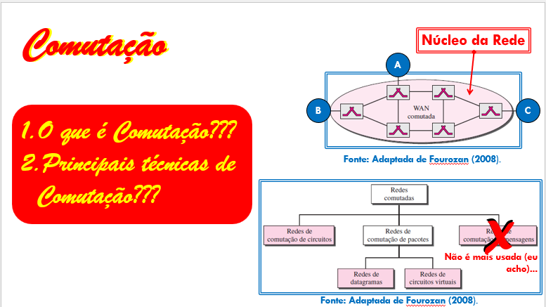
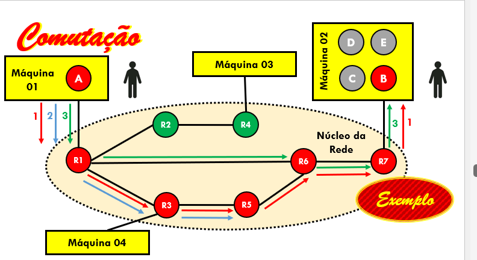

# Introdução às Redes de Computadores - 19/08/2026

## Comutação

(colocar o que é comutação)

(principais técnicas de comutação)

A mais usada é **Redes de datagrama** (explique bem abaixo como funciona)

Um roteador possui portas numeradas e uma tabela dinâmica chamada de tabela de roteamento.

- Tabela de roteamento:
  - Tem 2 colunas, a endereço de destino e a porta de saída.
  - Máquina 2 pra porta 3
  - Máquina 3 pra 1
  - Máquina 3 pra 3 (coloque esses ultimos em forma de tabela organizado)

Descobrindo a melhor porta, só mandar a mensagem por ela ao destinatário

Redes de diagrama é uma das mais escolhidas por que a rota é dinâmica, ou seja, pode mudar

pode ser que não chegue na mesma rota (explique)

## Protocolos
(explique aqui)

### Envio de dados
explique

### Recebimento de dados
explique

### Encaminhamento nos roteadores
explique

### Modelos de referência:
explique

#### Modelo OSI
explique